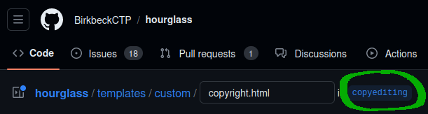
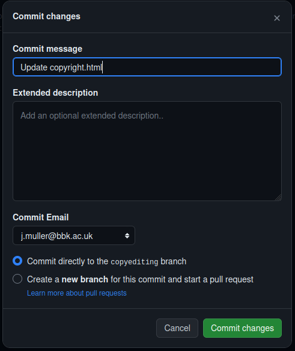

# Content management guide

This guide covers where the content on the OLH website is stored and how you can propose changes to it. It assumes you are familiar with using the Janeway content management system (CMS) for other journal or press websites, and that you have the right Janeway account permissions (staff access).

## Where the content is stored

All the content for the OLH website is stored in HTML files in this GitHub repository, not the Janeway content management system. This is different from most other journal or press websites.

You can see this if you go into the **Content manager** for the OLH website and look at a typical page. Most have a field called **Template** with a file ending in “.html” selected. This field controls which file in this repository is used for the page content. If there is a template selected, the **Content** field is ignored.

## Getting set up on GitHub

You’ll need to be set up on GitHub to make content changes.

1. Make sure you have a GitHub account. 

2. Check that you’ve been added to a GitHub team with the right access.

   - Whilst logged in to GitHub, from the user navigation dropdown menu, select **Settings**.

   - Under **Access**, select **Teams**.

   - You should see `openlibhums/olh` or another team starting with `openlibhums`.

3. Ask an OLH developer if you don’t think you have the right access.

## Managing content

These are the general steps to make any change to OLH site content.

1. Whilst logged into Janeway, find the page you want to edit in the Janeway CMS for the OLH website.

2. Check the **Template** field. If a file is selected, then the content comes from the Hourglass repository. Make a note of this file name. (If the **Template** field is not populated, you can edit the page with the **Content** field like any other CMS page.)

3. Whilst logged into GitHub, find the template file in the [`templates/custom` folder](https://github.com/openlibhums/hourglass/tree/copyediting/templates/custom).

4. Ensure that you are on the `copyediting` branch. Being on the right branch will help the developers manage your proposed changes.

   

4. Edit the file, and then select “Commit changes”. Enter a commit message, and leave “Commit directly to the copyediting branch” selected. Select “Commit changes”.

   

5. Open a pull request from the copyediting branch to the main branch. Or just ask a member of the tech team to do so for you. They will review your edits and merge them into the live version of the website.

## Changing a link to a media file

You can change a hyperlink to a Word doc or PDF with these steps.

1. Upload the new file to the appropriate
   [Media Manager in Janeway](https://janeway.readthedocs.io/en/latest/manager/content/index.html?highlight=media%20manager#media-files).
   
3. Copy the link Janeway gives you, and then paste it in to the appropriate page using the steps above. For example, in this line, you'd just replace the whole URL from "https" to ".doc". Keep the quotes around the link.

https://github.com/BirkbeckCTP/hourglass/blob/af0c2b87f06c271fe80639eb80fcf4960f72dbb2/templates/custom/journal-applications.html#L120
